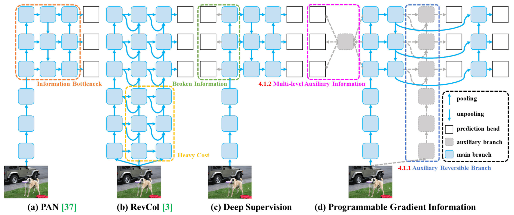
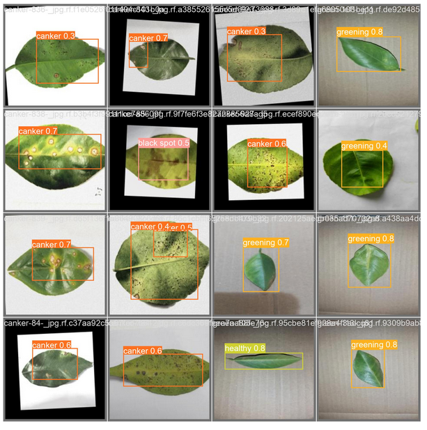
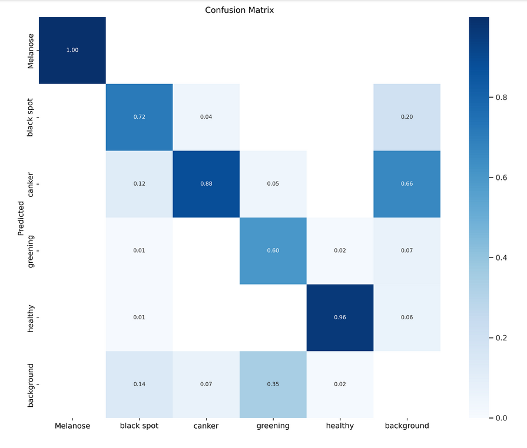

# 🍊 Deep Learning-Based Citrus Disease Detection  
## A Comparative Study of YOLOv5, YOLOv8, and YOLOv9 for Agricultural Disease Identification

---

## 📖 Abstract

Citrus diseases such as black spot, greening, canker, and melanose significantly affect crop yield and farmer livelihoods. This study presents a deep learning-based object detection framework using YOLOv5, YOLOv8, and YOLOv9 for early disease identification in citrus plants. A dataset of over 5300 annotated images was used to train and evaluate the models. Experimental results show that YOLOv9 achieved superior overall performance, with high detection accuracy across multiple disease categories. The proposed system provides an effective solution for automated citrus disease monitoring in smart agriculture.

---

## 🎯 Research Objectives

- Develop an automated citrus disease detection system  
- Train and evaluate YOLOv5, YOLOv8, and YOLOv9 on a custom dataset  
- Compare detection performance using standard metrics  
- Identify the most effective architecture for real-world agricultural deployment  

---

## 🦠 Disease Classes

The model detects five categories:

1. Black Spot  
2. Citrus Canker  
3. Citrus Greening (HLB)  
4. Melanose  
5. Healthy Leaves  

---

## 📊 Dataset Description

- Total Images: 5300+  
- Image Resolution: 224×224  
- Annotation Format: YOLO  
- Data Split:
  - 70% Training  
  - 20% Validation  
  - 10% Testing  

The dataset includes images collected from public agricultural datasets and field-captured samples.

> Dataset is excluded from this repository due to size limitations.

---

## 🧠 System Architecture

The complete pipeline consists of:

1. Data Collection  
2. Image Preprocessing  
3. YOLO Format Annotation  
4. Model Training  
5. Performance Evaluation  
6. Comparative Analysis  

Architecture diagrams are available in:

`images/architecture/`

### YOLOv9 Architecture



---

## 🧪 Experimental Setup

- Framework: PyTorch  
- GPU Training Environment  
- Batch Size: Optimized per model  
- Epochs: Tuned experimentally  
- Evaluation Metrics:
  - Precision  
  - Recall  
  - F1-Score  
  - mAP@0.5  
  - mAP@0.5:0.95  
  - Intersection over Union (IoU)  

---

## 📈 Results & Performance Comparison

| Model   | mAP@0.5 | Overall Accuracy |
|---------|---------|------------------|
| YOLOv5  | 86%     | 83.40%           |
| YOLOv8  | 80%     | 82.90%           |
| YOLOv9  | 85%     | 84.10% ⭐        |

### 🔎 Key Findings

- YOLOv5 achieved the highest mAP@0.5.  
- YOLOv9 demonstrated superior overall accuracy and balanced detection performance.  
- YOLOv8 showed competitive performance with optimized inference speed.  

YOLOv9 was selected as the best-performing model for this dataset.

---

## 🔍 Sample Predictions

Prediction outputs are available in:

`images/predictions/`

### YOLOv9 Detection Example



---

## 📊 Confusion Matrix

Confusion matrices are available in:

`images/confusion_matrix/`

### YOLOv9 Confusion Matrix



---

## ⚙️ Installation & Reproducibility

### Clone Repository

```bash
git clone https://github.com/shifulpiash00/Citrus-Disease-Detection-YOLO-Deep-Learning.git
cd Citrus-Disease-Detection-YOLO-Deep-Learning
```

### Install Dependencies

```bash
pip install -r requirements.txt
```

### Run Notebook

```bash
jupyter notebook
```

Execute:
- yolov5.ipynb  
- yolov8.ipynb  
- yolov9.ipynb  

---

## 🌍 Potential Applications

- Smart Agriculture Systems  
- Automated Crop Disease Monitoring  
- Precision Farming  
- AI-Assisted Agricultural Advisory Platforms  

---

## 🔮 Future Work

- Real-time mobile application deployment  
- Edge device optimization (NVIDIA Jetson, Raspberry Pi)  
- Integration with drone-based monitoring systems  
- Expansion to multi-crop disease detection  
- Cloud-based agricultural analytics dashboard  

---


Research Interests:
- Computer Vision  
- Deep Learning  
- Artificial Intelligence  
- AI in Agriculture  

---

## 📌 License

This project is intended for academic research and educational purposes.

---
